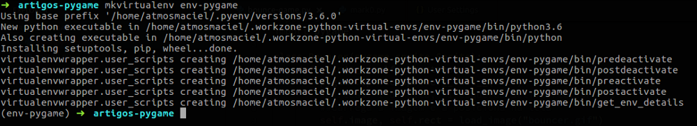

Neste artigo nós iremos criar um jogo utilizando o Pygame. Este primeiro exemplo será bem simples para que a gente possa absorver os conceitos iniciais do Pygame e também utilizar algumas de suas funções na prática.

## O Pygame

O Pygame é uma biblioteca do Python que estende o SDL(Simple DirectMedia Layer). O SDL é uma biblioteca multimídia multiplataforma, escrita em C. O Pygame funciona como um módulo do Python que fornece uma API para o SDL, além de várias implementações para criações gráficas com foco em jogos. Você pode saber mais aqui e em português aqui.

## Configurações iniciais

### Configurando o Virtualenv

Antes de mais nada, devo lembrar que se você está começando a se aventurar agora no Pygame, não necessariamente você deverá utilizar virtualenvs. Mas nós utilizaremos aqui por se tratar de uma boa prática.

Utilizar virtualenvs, nos permite, principalmente, separar as dependências do nosso projeto das bibliotecas globais do sistema operacional, assim nós mantemos versões compatíveis entre essas dependências sem nos preocupar que elas possam impactar nas bibliotecas globais do OS. Se você está usando Windows, isso não deve ser um problema pra você. Mas se estiver utilizando sistemas baseados no Unix, essa prática pode evitar problemas futuros.

Eu utilizo a seguinte abordagem: <a target="_blank" href="https://medium.com/welcome-to-the-django/guia-definitivo-para-organizar-meu-ambiente-python-a16e2479b753">Guia definitivo para organizar meu ambiente Python</a>

A partir do artigo acima, você pode iniciar seus estudos e definir a melhor forma de trabalhar com virtualenvs nos seus projetos.

Eu criei um virtualenv chamado env-pygame através do seguinte comando:

```mkvirtualenv env-pygame```


